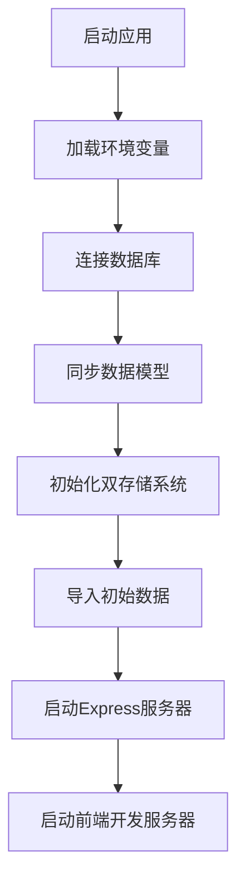
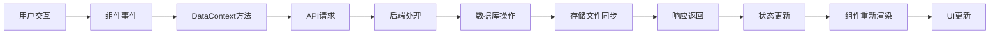
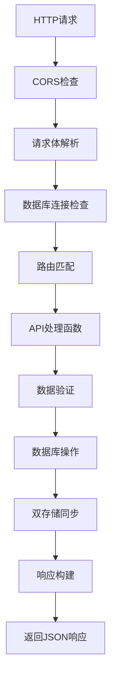
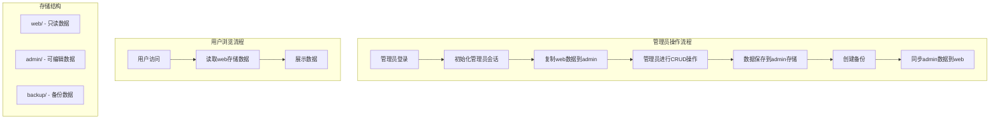

# 项目架构说明

## 目录结构

```
HengBeGer/
├── src/                    # 前端源码
│   ├── assets/            # 静态资源
│   │   └── 新建 文本文档.txt  # 游戏数据源文件
│   ├── db/                # 数据库相关
│   │   ├── models/        # 数据模型定义
│   │   │   ├── agent.js   # 代理人模型
│   │   │   ├── faction.js # 阵营模型
│   │   │   ├── role.js    # 职业模型
│   │   │   ├── rarity.js  # 稀有度模型
│   │   │   ├── soundengine.js # 音擎模型
│   │   │   ├── bumbo.js   # 邦布模型
│   │   │   └── drivedisk.js # 驱动盘模型
│   │   ├── config.js      # 数据库配置
│   │   ├── api.js         # 数据库API服务
│   │   └── initializeData.js # 数据初始化脚本
│   ├── App.jsx            # 主应用组件
│   ├── main.jsx           # 应用入口
│   ├── DataContext.jsx    # 数据上下文管理
│   ├── ZZZWiki.jsx        # 主要展示组件
│   ├── Filter.jsx         # 筛选组件
│   ├── AdminPanel.jsx     # 管理面板组件
│   └── *.css              # 样式文件
├── server/                # 后端服务器
│   └── index.js           # Express服务器入口
├── init-db.js             # 数据库初始化脚本
├── package.json           # 项目配置和依赖
├── vite.config.js         # Vite构建配置
├── .env.example           # 环境变量模板
└── README.md              # 项目说明
```

## 技术架构

### 前端架构
- **框架**: React 19 + Vite
- **路由**: React Router DOM
- **状态管理**: React Context API
- **样式**: 原生CSS + 响应式设计
- **构建工具**: Vite (支持热重载、代理等)

### 后端架构
- **框架**: Express.js
- **数据库**: MySQL
- **ORM**: Sequelize
- **中间件**: CORS、JSON解析、请求日志
- **环境配置**: dotenv

### 数据库设计

#### 核心实体表

**1. agents (代理人表)**
```sql
CREATE TABLE agents (
  id INT PRIMARY KEY AUTO_INCREMENT,
  name VARCHAR(255) NOT NULL,           -- 代理人名称
  element VARCHAR(50),                   -- 属性 (物理/火/冰/电/以太)
  image VARCHAR(255),                    -- 图片路径
  factionId INT,                         -- 阵营外键
  roleId INT,                           -- 职业外键
  rarityId INT,                         -- 稀有度外键
  createdAt TIMESTAMP,
  updatedAt TIMESTAMP
);
```

**2. sound_engines (音擎表)**
```sql
CREATE TABLE sound_engines (
  id INT PRIMARY KEY AUTO_INCREMENT,
  name VARCHAR(255) NOT NULL,           -- 音擎名称
  image VARCHAR(255),                    -- 图片路径
  rarityId INT,                         -- 稀有度外键
  roleId INT,                           -- 职业外键
  createdAt TIMESTAMP,
  updatedAt TIMESTAMP
);
```

**3. bumbos (邦布表)**
```sql
CREATE TABLE bumbos (
  id INT PRIMARY KEY AUTO_INCREMENT,
  name VARCHAR(255) NOT NULL,           -- 邦布名称
  image VARCHAR(255),                    -- 图片路径
  rarityId INT,                         -- 稀有度外键
  createdAt TIMESTAMP,
  updatedAt TIMESTAMP
);
```

**4. drive_disks (驱动盘表)**
```sql
CREATE TABLE drive_disks (
  id INT PRIMARY KEY AUTO_INCREMENT,
  name VARCHAR(255) NOT NULL,           -- 驱动盘名称
  image VARCHAR(255),                    -- 图片路径
  createdAt TIMESTAMP,
  updatedAt TIMESTAMP
);
```

#### 关联实体表

**5. factions (阵营表)**
```sql
CREATE TABLE factions (
  id INT PRIMARY KEY AUTO_INCREMENT,
  name VARCHAR(255) NOT NULL,           -- 阵营名称
  description TEXT,                      -- 阵营描述
  createdAt TIMESTAMP,
  updatedAt TIMESTAMP
);
```

**6. roles (职业表)**
```sql
CREATE TABLE roles (
  id INT PRIMARY KEY AUTO_INCREMENT,
  name VARCHAR(255) NOT NULL,           -- 职业名称 (攻击/防御/异常/支援/穿透)
  description TEXT,                      -- 职业描述
  createdAt TIMESTAMP,
  updatedAt TIMESTAMP
);
```

**7. rarities (稀有度表)**
```sql
CREATE TABLE rarities (
  id INT PRIMARY KEY AUTO_INCREMENT,
  name VARCHAR(10) NOT NULL,            -- 稀有度 (S/A/B)
  createdAt TIMESTAMP,
  updatedAt TIMESTAMP
);
```

#### 关联关系设计
```
┌─────────────┐    ┌─────────────┐    ┌─────────────┐
│   Agents    │────│  Factions   │    │    Roles    │
│             │    │             │    │             │
│ factionId   │────│     id      │    │     id      │
│ roleId      │────┼─────────────┼────│             │
│ rarityId    │────┼─────────────┼────┼─────────────┤
└─────────────┘    └─────────────┘    │             │
       │                               └─────────────┘
       │           ┌─────────────┐              │
       │           │  Rarities   │              │
       │           │             │              │
       └───────────│     id      │──────────────┘
                   └─────────────┘
                          │
                   ┌─────────────┐    ┌─────────────┐
                   │SoundEngines │    │   Bumbos    │
                   │             │    │             │
                   │ rarityId    │────│ rarityId    │
                   │ roleId      │    └─────────────┘
                   └─────────────┘
```

**关联关系说明**:
- 代理人 → 阵营 (多对一): 每个代理人属于一个阵营
- 代理人 → 职业 (多对一): 每个代理人有一个职业
- 代理人 → 稀有度 (多对一): 每个代理人有一个稀有度
- 音擎 → 职业 (多对一): 每个音擎适配一个职业
- 音擎 → 稀有度 (多对一): 每个音擎有一个稀有度
- 邦布 → 稀有度 (多对一): 每个邦布有一个稀有度
- 驱动盘: 独立实体，无外键关联

## API设计

### RESTful API端点

#### 系统端点
```http
GET  /health                    # 健康检查
GET  /api/data                  # 获取所有数据 (包含关联信息)
```

**响应示例 - GET /api/data**:
```json
{
  "agents": [
    {
      "id": 1,
      "name": "艾莲",
      "element": "冰",
      "image": "ellen.jpg",
      "faction": "维多利亚家政",
      "role": "攻击",
      "rarity": "S"
    }
  ],
  "soundEngines": [...],
  "bumbos": [...],
  "driveDisks": [...],
  "factions": [...],
  "roles": [...],
  "rarities": [...]
}
```

#### 代理人管理 API
```http
POST   /api/agents             # 添加代理人
PUT    /api/agents/:id         # 更新代理人
DELETE /api/agents/:id         # 删除代理人
```

**请求示例 - POST /api/agents**:
```json
{
  "name": "艾莲",
  "element": "冰",
  "image": "ellen.jpg",
  "faction": "维多利亚家政",    // 支持名称或ID
  "role": "攻击",              // 支持名称或ID
  "rarity": "S"               // 支持名称或ID
}
```

#### 音擎管理 API
```http
POST   /api/sound-engines      # 添加音擎
PUT    /api/sound-engines/:id  # 更新音擎
DELETE /api/sound-engines/:id  # 删除音擎
```

**请求示例 - POST /api/sound-engines**:
```json
{
  "name": "钢铁肉垫",
  "image": "steel_cushion.jpg",
  "role": "攻击",              // 支持名称或ID
  "rarity": "S"               // 支持名称或ID
}
```

#### 邦布管理 API
```http
POST   /api/bumbos            # 添加邦布
PUT    /api/bumbos/:id        # 更新邦布
DELETE /api/bumbos/:id        # 删除邦布
```

**请求示例 - POST /api/bumbos**:
```json
{
  "name": "安比",
  "image": "amillion.jpg",
  "rarity": "A"               // 支持名称或ID
}
```

#### 驱动盘管理 API
```http
POST   /api/drive-disks       # 添加驱动盘
PUT    /api/drive-disks/:id   # 更新驱动盘
DELETE /api/drive-disks/:id   # 删除驱动盘
```

**请求示例 - POST /api/drive-disks**:
```json
{
  "name": "混沌爵士",
  "image": "chaos_jazz.jpg"
}
```

#### API 响应格式

**成功响应**:
```json
{
  "success": true,
  "data": { ... },
  "message": "操作成功"
}
```

**错误响应**:
```json
{
  "success": false,
  "error": "错误信息",
  "code": "ERROR_CODE"
}
```

#### 特殊功能

1. **关联数据自动查找**: API 支持通过名称或ID查找关联数据
2. **数据同步**: 每次 CUD 操作后自动同步到存储文件
3. **错误处理**: 完整的错误信息和状态码
4. **数据验证**: 请求数据格式验证和业务规则检查

## 数据流架构

### 1. 应用初始化流程


### 2. 前端数据流


**详细说明**:
- **数据获取**: 组件挂载 → useEffect → fetchData() → GET /api/data → 状态更新
- **数据添加**: 表单提交 → addAgent() → POST /api/agents → 数据库插入 → 存储同步 → 状态刷新
- **数据筛选**: 筛选器变更 → Filter组件 → 条件传递 → ZZZWiki组件 → 数据过滤 → 显示更新

### 3. 后端请求处理流程


### 4. 双存储系统数据流


**存储路径说明**:
```
src/db/storage/
├── web/                    # 网页端数据 (用户浏览)
│   ├── agents.json
│   ├── soundEngines.json
│   ├── bumbos.json
│   └── driveDisks.json
├── admin/                  # 管理员端数据 (管理操作)
│   ├── agents.json
│   ├── soundEngines.json
│   ├── bumbos.json
│   └── driveDisks.json
└── backup/                 # 备份数据 (灾难恢复)
    ├── agents_20240101_120000.json
    └── ...
```

### 5. 数据同步机制

**数据库 ↔ 存储文件同步**:
```javascript
// 每次数据库操作后自动同步
const syncDatabaseToStorage = async () => {
  const allData = await getAllDataFromDatabase();
  await dualStorageManager.saveToWebStorage(allData);
  await dualStorageManager.saveToAdminStorage(allData);
};
```

**管理员端 → 网页端同步**:
```javascript
// 管理员操作完成后同步
const syncAdminToWeb = async () => {
  // 1. 备份当前网页端数据
  await backupWebData();
  
  // 2. 复制管理员端数据到网页端
  const adminData = await getAllAdminData();
  await saveToWebStorage(adminData);
};
```

## 安全考虑

- 环境变量管理敏感信息
- CORS配置限制跨域访问
- 请求体大小限制
- 数据库连接状态检查
- 输入验证和错误处理

## 性能优化

- Vite构建优化和热重载
- 数据库连接池配置
- API响应缓存策略
- 图片资源优化
- 代码分割和懒加载